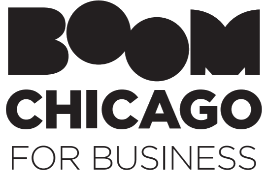
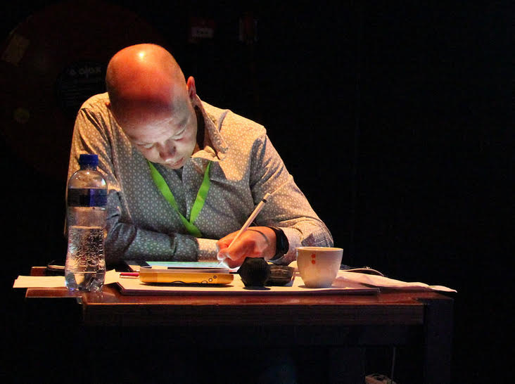
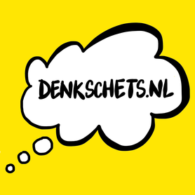

# Social Events
{:.sub-page-header}
&nbsp;
{:.sub-page-border}

**Join us for a social programme hosted by the Amsterdam-based comedy theatre Boom Chicago.**

| Mon, Oct 26, 2020   6:30 pm - 7:30 pm CET     ||||||||||| **Conference opening**   HCOMP Comedy Roast, followed by an overview of the week’s programme. |
| Tue, Oct 27, 2020   7:00 pm - 8:00 pm CET    ||||||||||| **HCOMP social & awards ceremony**   How much do you know about the HCOMP crowd?   Join us for a game of HCOMP People’s Bingo, followed by the awards for best papers. |
| Wed, Oct 28, 2020   4:55 pm - 5:00 pm CET     ||||||||||| **Comedy injection with your coffee break** |
| Thu, Oct 29, 2020   6:00 pm - 7:00 pm CET    ||||||||||| **Closing**   We’ll wrap up the week with a session with loads of laughs and high energy, and get you excited for HCOMP2021 |

 

## Boom Chicago

Boom Chicago is a creative company that has enjoyed great success reaching international audiences for more than 27 years. They strongly believe that humor makes business better. They use comedy to create impactful content, support messages and make people laugh at digital and traditional events across the globe and in their own theater on the Rozengracht in Amsterdam.

Boom Chicago performance is sponsored by HCOMP’s co-host the [Netherlands Institute for Sound and Vision](sound_and_vision.html).

## Illustrated papers

During the week, Dutch artist Elco van Staveren will create illustrations for the HCOMP papers. You can watch these illustrations come to life on the underline platform with the videos for Blue Sky and doctoral consortium sessions.

Elco van Staveren of [Denkschets.nl](http://Denkschets.nl) visualizes complex issues and strategies for organizations. Hand-drawn and, if desired, live on a screen. With [Denkschets.nl](http://Denkschets.nl), he combines his academic background and expertise in communication, management and use of new technology, and especially his love for visualizing stories.

