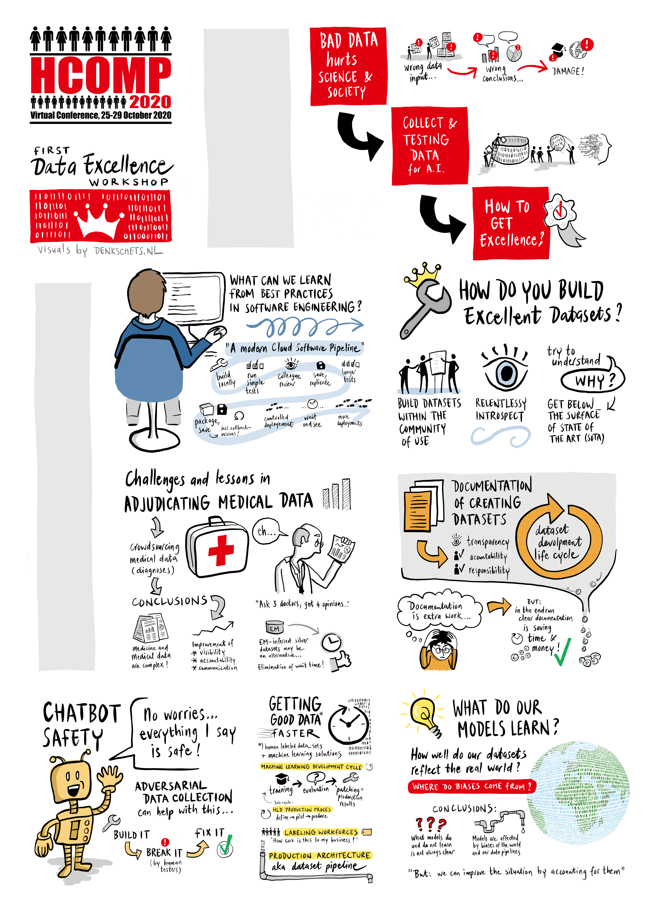
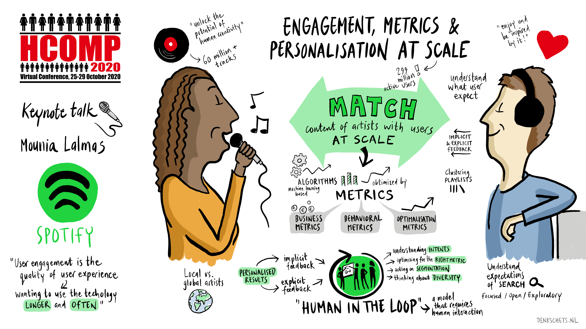
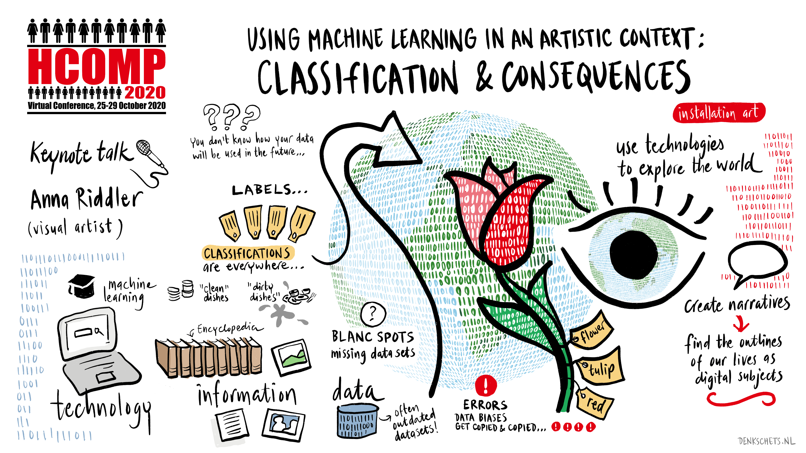
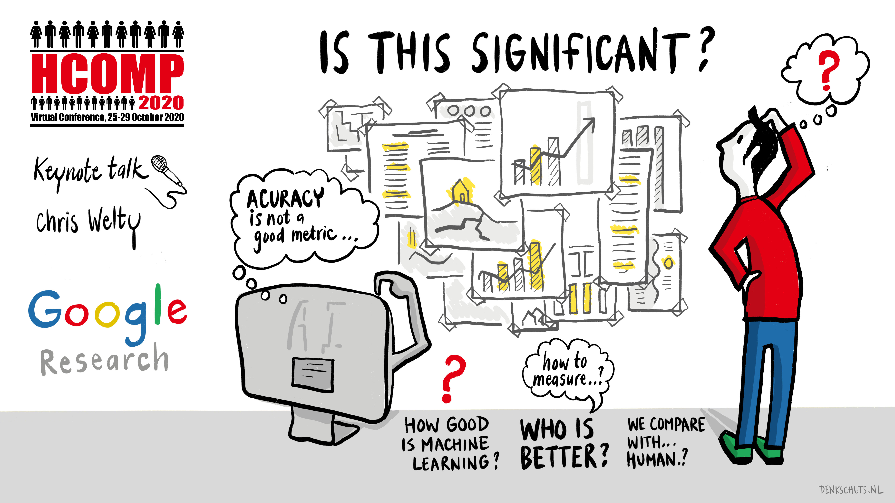
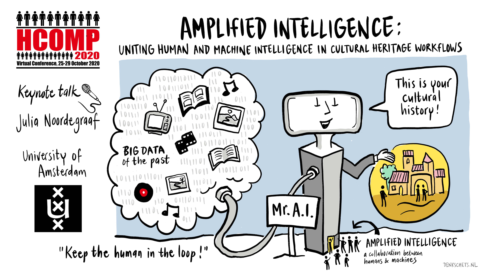
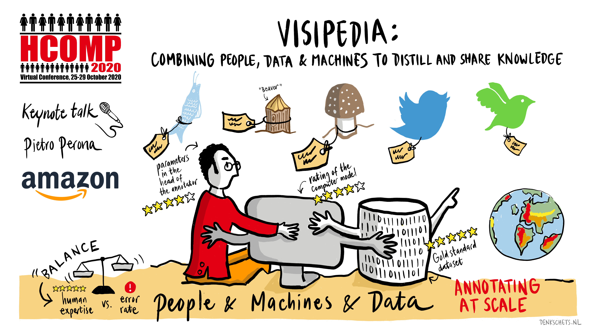
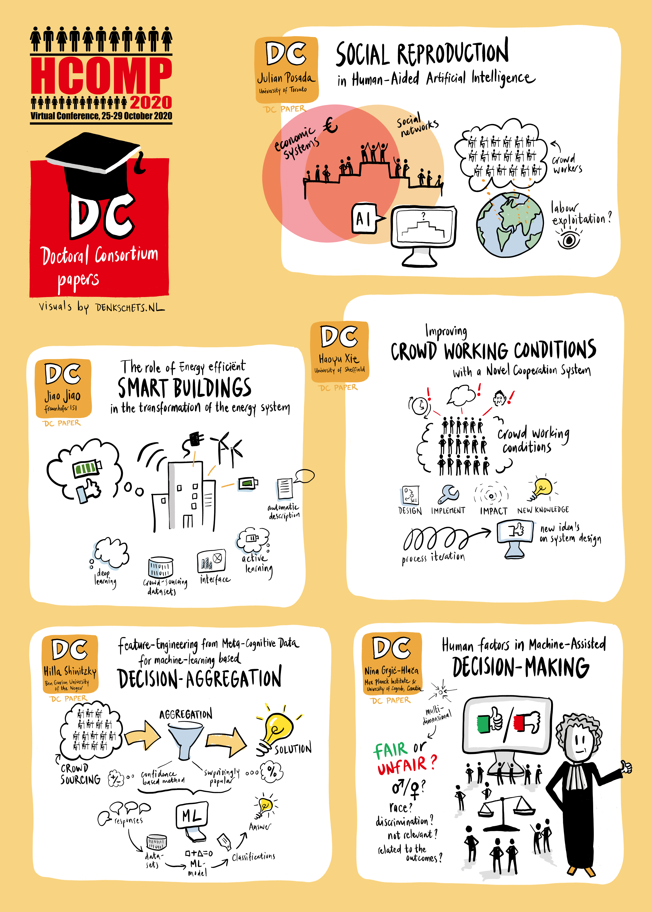
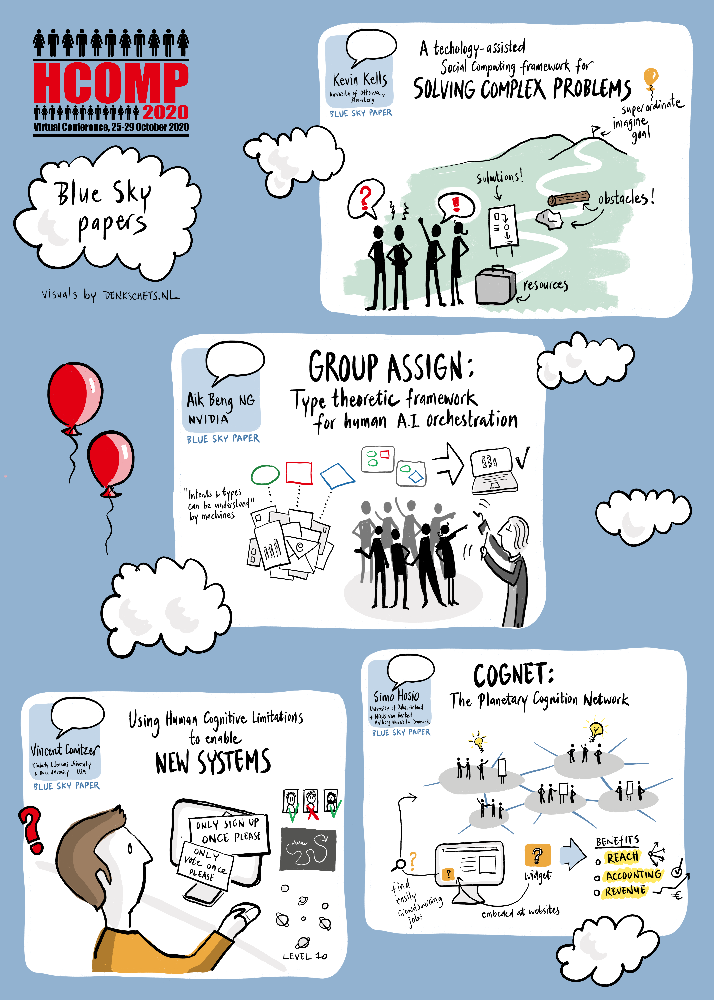

# HCOMP Visuals
{:.sub-page-header}
&nbsp;
{:.sub-page-border}

During the week, Dutch artist Elco van Staveren will create illustrations for the HCOMP papers. You can watch these illustrations come to life on the underline platform with the videos for Blue Sky and doctoral consortium sessions.

Elco van Staveren of [Denkschets.nl](http://denkschets.nl/) visualizes complex issues and strategies for organizations. Hand-drawn and, if desired, live on a screen. With [Denkschets.nl](http://denkschets.nl/), he combines his academic background and expertise in communication, management and use of new technology, and especially his love for visualizing stories.

You can see the illustrations for past tasks and sessions below!

## Workshop 1: Data Excellence Workshop

## Keynote Speaker: Mounia Lalmas

## Keynote Speaker: Anna Riddler

## Keynote Speaker: Chris Welty

## Keynote Speaker: Julia Noordegraaf

## Keynote Speaker: Pietro Perona

## Doctoral Consortium

## Blue Sky Ideas

   