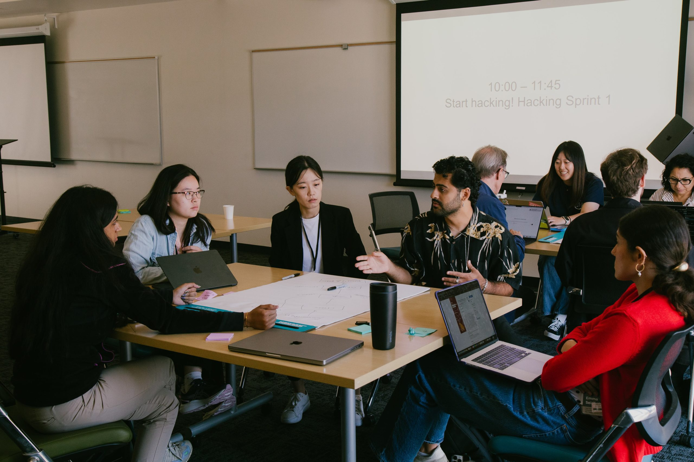
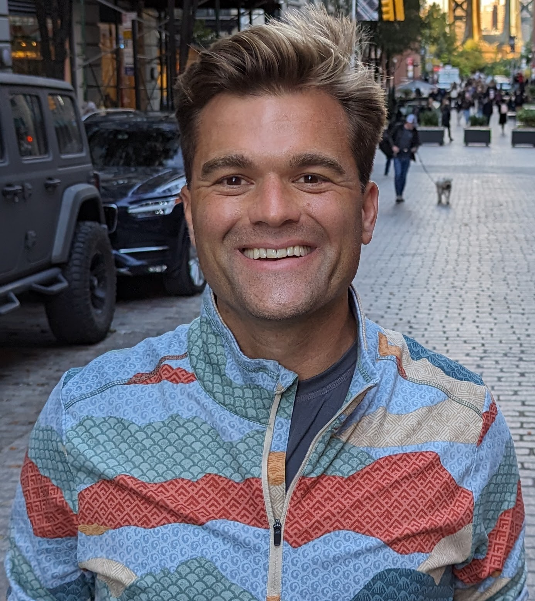
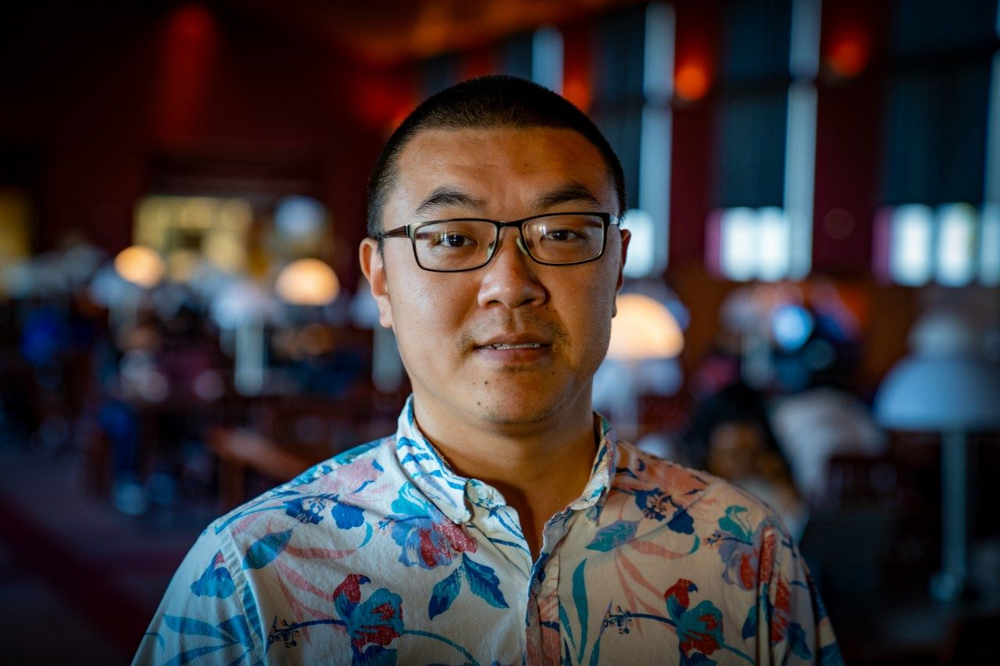

# CrowdCamp
{:.sub-page-header}
&nbsp;
{:.sub-page-border}

- [Important Dates](#dates)
- [Overview](#overview)
- [Registration](#registration)
- [CrowdCamp Co-Chairs](#chairs)

---<!-- SUB-NAVBAR -->

    <a href="#dates" class="subnav-link active">Dates</a>
    <a href="#overview" class="subnav-link">Overview</a>
    <a href="#registration" class="subnav-link">Registration</a>
    <a href="#chairs" class="subnav-link">Co-Chairs</a>



CrowdCamp 2025: a team mapping out a wicked problem at ACM Collective Intelligence 2025.

# Important Dates
{:#dates}
{:.sub-page-header}
&nbsp;
{:.sub-page-border}

* **Interest form closes:** Monday, August 31, 2026
* **CrowdCamp:** Sunday, September 27, 2026, 9:00 AM–4:00 PM
* **Location:** Virginia Tech's Academic Building One (AB1), Washington, DC area

# Overview
{:#overview}
{:.sub-page-header}
&nbsp;
{:.sub-page-border}

CrowdCamp is a hackathon that takes place during HCOMP/CI 2026 for researchers and practitioners interested in human computation, crowdsourcing, collective intelligence, and AI. It's an interdisciplinary, collaborative event with no technical prerequisites: you don't need to know how to code to take part! Students, researchers, practitioners, and industry folks from across disciplines (social science, programming, ethnography, design, and beyond) come together to explore [wicked problems](https://en.wikipedia.org/wiki/Wicked_problem): complex, real-world challenges that call for human–AI collaboration.

Teams form around a set of challenges connected to this year's conference theme, *Connections*, and participants spend the day building prototypes, study designs, algorithmic concepts, pilot studies, or whatever moves an idea forward. We encourage lightweight, fast-moving approaches like vibe coding, Figma mockups, and creative brainstorming to push boundaries and spark meaningful conversations. Bring your own wicked problem, or pick from starter ideas we'll provide. Possible directions might include:

* Crowdsourcing and Civics
* Learnersourcing in-the-wild
* Advancing Citizen Science
* Community-driven Journalism
* New Economic Models for Human Crowd Work
* Revisiting the "Future of Crowd Work"

Running for over a decade across HCI and AI venues, CrowdCamp has seeded influential work — including the paper [The Future of Crowd Work](https://dl.acm.org/doi/pdf/10.1145/2441776.2441923) — along with numerous tools and follow-on projects.

# Registration
{:#registration}
{:.sub-page-header}
&nbsp;
{:.sub-page-border}

CrowdCamp 2026 is part of **HCOMP 2026** (September 27–30, Virginia Tech's Academic Building One, in the Washington, DC area), held jointly with **CI 2026**, where a single badge covers all conference events.

    
CrowdCamp is a workshop with its own registration and fee, separate from the main conference. You can register for the workshop on its own, for the full conference, or for both.

    <h3>Take part in CrowdCamp 2026</h3>
    
Express your interest by Monday, August 31, then complete your workshop registration.

    

        <a href="https://forms.gle/vWQJ3mftk4EzZ2A38" class="action-btn" target="_blank" rel="noopener noreferrer" style="background-color: var(--primary-color);">Sign up to express interest &rarr;</a>
        <a href="registration.html" class="action-btn" style="background-color: var(--secondary-color);">Register for the workshop &rarr;</a>
    

# CrowdCamp Co-Chairs
{:#chairs}
{:.sub-page-header}
&nbsp;
{:.sub-page-border}

For questions about CrowdCamp, contact the chairs at [hcomp-ci-2026-crowdcamp@acm.org](mailto:hcomp-ci-2026-crowdcamp@acm.org).

  

    
    <h3 style="font-size: 1.25rem;"><a class="theme-link-org hcomp-link" href="https://bmcinnis.github.io/" target="_blank" rel="noopener noreferrer">Brian McInnis</a></h3>
    
University of Texas at Austin, USA

  

  

    
    <h3 style="font-size: 1.25rem;"><a class="theme-link-org hcomp-link" href="https://stephanie-valencia.com/" target="_blank" rel="noopener noreferrer">Stephanie Valencia</a></h3>
    
University of Maryland, College Park, USA

  

  

    
    <h3 style="font-size: 1.25rem;"><a class="theme-link-org ci-link" href="https://ykotturi.github.io/" target="_blank" rel="noopener noreferrer">Yasmine Kotturi</a></h3>
    
University of Maryland, Baltimore County, USA

  

  

    
    <h3 style="font-size: 1.25rem;"><a class="theme-link-org ci-link" href="https://www.cs.jhu.edu/~yaxing/" target="_blank" rel="noopener noreferrer">Yaxing Yao</a></h3>
    
Johns Hopkins University, USA

  

